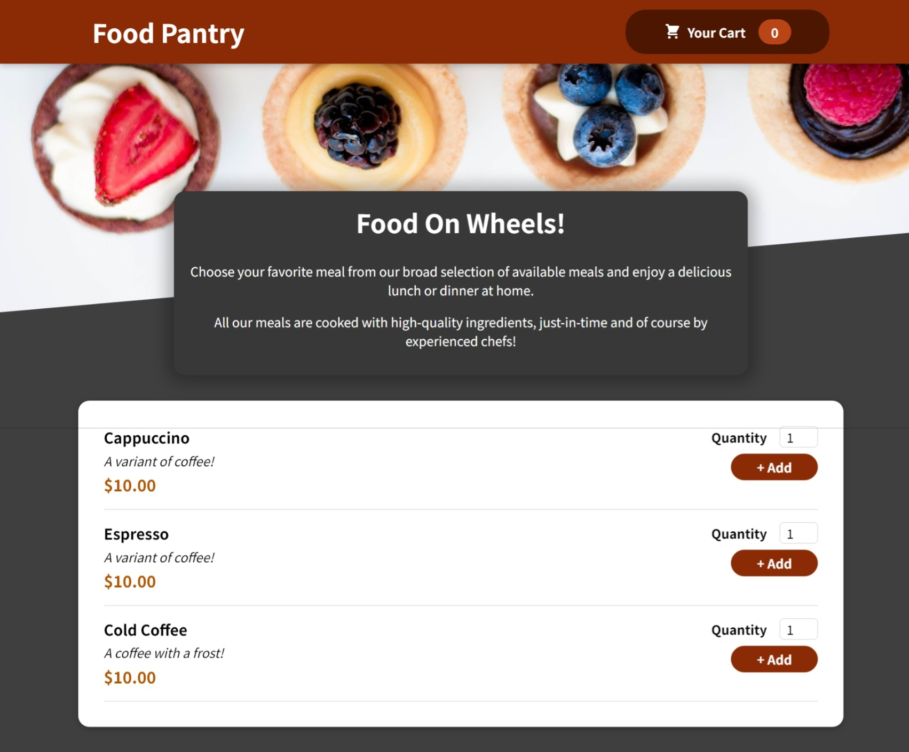
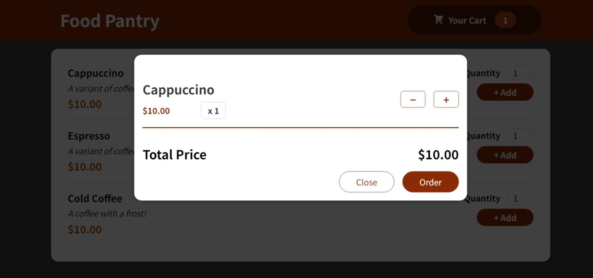
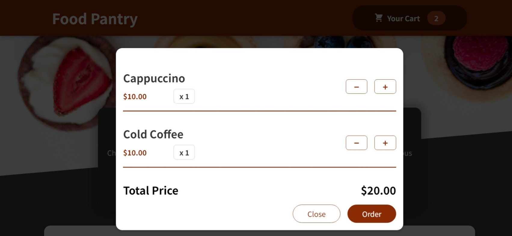

### Food Pantry Application

Project based on **React.js**, a simple cart application which lets you add food displayed in the list to the shopping cart.

### Pre Requisites

- **Node.js** version **21** or greater.

### Dependencies used by the project

1. **react**.
2. **jest**.

### Available scripts

1. `npm start` for running the application in local environment.

### Instructions

1. Visit `http://localhost:3000` in the browser.

2. Home page of the application shows different food items available. 

3. Click on the **Add** button to add to add the item to cart, here is a sample example. 

4. Click on **Add** to add another item to the cart. 
